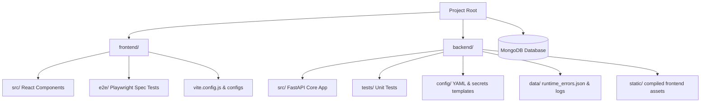

# 🚀 Autonomous Multi-Platform AI Job Application System

An autonomous, end-to-end job board search, ingestion, compatibility scoring, and form-filling engine. It features a premium, glassmorphic client control dashboard, an AI-powered Resume Hub with dual ATS optimization scorecards, and local document generation.

---

## 📖 Table of Contents
* 📘 **[Complete User Manual](doc/usermanual.md)**
* 🚀 **[Render Deployment Guide](doc/deployment.md)**
1. [Core Features](#-core-features)
2. [Subsystem Architecture & Components](#-subsystem-architecture--components)
3. [FastAPI REST API Reference](#-fastapi-rest-api-reference)
4. [Technology Stack](#-technology-stack)
5. [Prerequisites](#-prerequisites)
6. [Setup & Running Guide](#-setup--running-guide)
7. [Configuration Guide](#-configuration-guide)
8. [Verifying the Installation](#-verifying-the-installation)
9. [Usage Guide](#-usage-guide)

---

## ✨ Core Features

### 🔍 1. Multi-Threaded Ingestion & Scoring Engine
* **Concurrent Naukri Scans**: Crawls job boards concurrently across keyword/location pairs in a thread-safe worker pool, enforcing request rate caching to drop duplications.
* **Precision Search Filter Mapping**: Automatically maps technical skills from profiles to Naukri query vectors for highly targeted results.
* **Experience & Workplace Type Matching**: Prefilters results at the crawling source according to the candidate's seniority target ($\pm2$ years) and filters by workplace types (Remote, Hybrid, On-site) and application routes.
* **Weighted Linear Compatibility Score**: Scores roles using a multi-dimensional linear combination model ($Sc = \sum \omega_j \cdot \sigma_j$) analyzing title matches, skills matrices, location constraints, and company blacklists.

### 📄 2. AI-Powered Resume Hub & Vault
* **Ingestion Zone**: Drag-and-drop ingestion of PDF and DOCX formats. Features docx unzipping and XML text parsing natively without compiled third-party dependencies.
* **ATS Compatibility Auditing**: circular conic scorecard gauges displaying Original vs. Tailored scores side-by-side (Original in Red/Danger, Tailored in Teal/Accent).
* **Side-by-Side Visual Diffs**: Custom word-level highlights displaying layout-agnostic additions (in green) and deletions (in red strike-through) between original and tailored structures.
* **MongoDB Resumes Vault**: Stores both original and tailored resumes as base64-encoded PDF binary buffers, plain text extracts, and structured JSON profiles directly in MongoDB, supporting database-level Secure Deletions and zero filesystem dependencies.
* **Secure SMTP Emailer**: Decrypts passwords stored securely in MongoDB user configurations to email tailored PDFs as secure attachments over TLS/SSL connections.

### 🤖 3. Custom Resume Customizer
* **Preservation Engine**: Structures raw resumes dynamically without enforcing rigid candidate templates, maintaining original margins, headings, section order, and layout.
* **Gemini Optimization Loop**: Custom tailors the resume text to match target keywords and responsibilities utilizing `gemini-3.5-flash` or `gemini-3.1-flash-lite` models to hit an 85%+ compatibility threshold.
* **Robust Local Fallback**: Automatically fallbacks to local keyword injection heuristics in $0.1$ seconds upon detecting a 429 quota exhaustion limit.
* **Cryptographic Hash Buster**: Programmatically alters hidden PDF metadata hashes, ensuring upload databases register each document as completely unique.

### 🛠️ 4. Stateful Playwright Submissions Driver
* **Playwright Fill Graph**: Represents form layouts as states, scanning page DOM elements, matching field accessibility labels, and filling text, selects, checkboxes, or uploading files.
* **Antidetect Automation**: Redefines browser attributes like `navigator.webdriver` to `undefined` before page load to hide automated crawler bot indicators.
* **Manual Intervention Mode**: For manual-apply configurations, crawler proceeds through form-filling and opens the headed browser context directly on the candidate's screen, bypassing the automated close block to allow manual review and click.

---

## 📐 Subsystem Architecture & Components

The application is structured as a decoupled architecture containing a modern React SPA client communicating over a JSON REST API with a FastAPI Python backend, backed by MongoDB for stateless cloud readiness, and coupled with a CLI interface for background automation.

### System Workflow Diagram
```mermaid
graph TD
    A[React Client Dashboard] -->|REST API Requests| B[FastAPI Web Server]
    B -->|Saves/Queries Data| DB[(MongoDB Database)]
    
    %% Ingestion Flow
    B -->|Concurrent Threads| C[Parallel Job Ingestion]
    C -->|Stealth Scraping| D[Naukri Portal]
    C -->|Parse Details| E[BeautifulSoup4 Extractor]
    E -->|Evaluate Fit| F[Scoring Matrix]
    F -->|Write Cache| DB
    
    %% Resume Hub Flow
    B -->|Process Upload| H[Resume Hub Ingestion]
    H -->|DOCX/PDF Extract| I[Text Parser]
    I -->|Tailor Request| J[AI Resume Customizer]
    J -->|Query Prompt| K[Gemini API / Heuristic Fallback]
    K -->|Compile PDF (Temp)| L[ReportLab Compiler]
    L -->|Base64 & Save PDF| DB
    
    %% Submission Flow
    B -->|Trigger Background Task| N[Playwright Submissions Graph]
    N -->|Fetch PDF Bytes| DB
    N -->|Restore/Save Cookies| DB
    N -->|Launch with Antidetect| O[Stealth Playwright Driver]
    O -->|Easy Apply| P[Auto-submit Form]
    O -->|Manual Apply| Q[Pause Browser for User Review]
```

### Folder Architecture & File Layout


### 1. Main Entry Point ([backend/main.py](file:///Users/nitinpradhan/Learning/job_application_system/backend/main.py))
Coordinates all CLI operations. Supports three principal parameters:
- `--action test-graph`: Simulates a mock DOM form-filling pipeline using the `FormGraphOrchestrator` to validate state transition correctness.
- `--action bump-naukri`: Logs in to Naukri, retrieves the user's original resume from MongoDB to load dynamically into a temporary path, applies the PDF Hash Buster, and uploads it to refresh candidate visibility.
- `--action apply --job-id <id>`: Automates the apply sequence for a single job: extracts details, tailors the resume from the baseline MongoDB record, syncs to Google Drive, and executes form submissions.

### 2. FastAPI Web Server ([backend/src/server.py](file:///Users/nitinpradhan/Learning/job_application_system/backend/src/server.py))
Serves static assets and provides JSON API endpoints. It runs background threads for crawling and applying, logs output to the dashboard console, and manages configurations. Authentic sessions and passwords/SMTP details are stored securely in MongoDB.

### 3. Secure Browser Driver ([backend/src/browser_driver.py](file:///Users/nitinpradhan/Learning/job_application_system/backend/src/browser_driver.py))
Wraps Playwright's Chromium execution engine. Key capabilities:
- **Anti-Bot Evasions**: Injects custom Javascript on browser initialization to mask automated crawler indicators.
- **CDP Integration**: Connects over a running Chrome debugger port to run automation inside an active native browser session.
- **Session Preservation**: Stores and restores cookies, localStorage, and browser configurations directly to/from MongoDB's `browser_states` collection, eliminating local session state files.

### 4. Job Ingestion & Extractor ([backend/src/job_crawler.py](file:///Users/nitinpradhan/Learning/job_application_system/backend/src/job_crawler.py))
Orchestrates parallel search-crawling. It generates query slugs matching candidate skills, crawls search results, extracts job details via BeautifulSoup4, and classifies apply types dynamically by checking for external redirect strings on active elements. It drops duplicate URLs and uses a fallback registry of high-fidelity local software engineering jobs when offline.

### 5. Scoring Matrix ([backend/src/scoring.py](file:///Users/nitinpradhan/Learning/job_application_system/backend/src/scoring.py))
Uses a weighted linear combination scoring model to determine match fitness. If a job title contains a blacklisted phrase, it is instantly disqualified ($0.0$).
* **Title Match (25% Weight)**: Matches title keywords.
* **Location Match (20% Weight)**: Verifies city target matches.
* **Tech Stack Match (25% Weight)**: Ratio of matched technologies.
* **Workplace Type Match (15% Weight)**: Matches Remote, Hybrid, or On-site preference.
* **Seniority Match (15% Weight)**: Compares years of experience required vs. candidate profile.

### 6. AI Resume Customizer ([backend/src/resume_tweaker.py](file:///Users/nitinpradhan/Learning/job_application_system/backend/src/resume_tweaker.py))
Optimizes resume configurations:
- **Gemini Context Loop**: Customizes the resume description, summary, skills matrix, and professional bullet points based on the target job description while retaining dates, places, and authentic titles.
- **0.1s Heuristic Fallback**: Instantly falls back to local regex matching and keyword insertion heuristics if the Gemini API key is missing or rate limits are hit.
- **ReportLab Compiler**: Renders structured JSON data into structured, single-column, highly readable, ATS-compliant PDFs with custom margin controls.

### 7. Cryptographic Hash Buster ([backend/src/document_generator.py](file:///Users/nitinpradhan/Learning/job_application_system/backend/src/document_generator.py))
Appends randomized metadata attributes (`/ModifierID`, `/Keywords`) to compiled PDFs. This alters the file's binary signature and cryptographic hash (MD5, SHA-256) on every generation, preventing Naukri from identifying the upload as a duplicate document, thereby triggering profile update ranking loops.

### 8. Stateful Form Graph ([backend/src/form_graph.py](file:///Users/nitinpradhan/Learning/job_application_system/backend/src/form_graph.py))
Models online application forms as stateful machines. It iterates through four state nodes:
1. **Initialize**: Validates the endpoint security protocol and URL.
2. **Extract**: Scrapes input fields, selects, textareas, file upload targets, and associates adjacent descriptive labels.
3. **Generate**: Binds user data (names, demographics, compliance answers) to inputs.
4. **Assemble**: Generates the form payload, uploads PDFs, takes browser screenshots, and clicks submit.

### 9. Google Drive Synchronization ([backend/src/gdrive_manager.py](file:///Users/nitinpradhan/Learning/job_application_system/backend/src/gdrive_manager.py))
If synchronization is enabled, automatically uploads generated PDFs to the user's Google Drive. The manager retrieves client secrets and access tokens on-the-fly from MongoDB user configurations.

### 10. Cryptographic Key Vault ([backend/src/crypto_manager.py](file:///Users/nitinpradhan/Learning/job_application_system/backend/src/crypto_manager.py))
Implements Fernet symmetric encryption to encrypt secrets. Decryption keys are loaded securely at runtime, ensuring sensitive credentials (Naukri password, API keys, SMTP credentials) are never stored in plaintext format.

---

## FastAPI REST API Reference

The backend web server exposes the following endpoints for the frontend dashboard:

| Endpoint | Method | Description |
| :--- | :--- | :--- |
| `/api/config` | `GET` | Retrieves `searches.yaml` content and decrypted constants from MongoDB. |
| `/api/config` | `POST` | Updates and encrypts searches and constant configurations in MongoDB. |
| `/api/run` | `POST` | Launches main.py actions (`test-graph` / `bump-naukri`) in background threads. |
| `/api/logs` | `GET` | Returns running log streams from background tasks. |
| `/api/jobs` | `GET` | Fetches discovered and compatibility-scored listings from MongoDB. |
| `/api/jobs/scan` | `POST` | Triggers a multi-threaded parallel crawl of Naukri job boards. |
| `/api/jobs/scan/status` | `GET` | Returns scanning state (`is_scanning` and count). |
| `/api/resume-hub/upload` | `POST` | Ingests PDF/DOCX resumes, structures text via Gemini, and saves to MongoDB. |
| `/api/resume-hub/tailor` | `POST` | Tailors the resume PDF/JSON, computes ATS audits, and registers in MongoDB. |
| `/api/resume-hub/files` | `GET` | Lists all tailored resume copies for the authenticated user from MongoDB. |
| `/api/resume-hub/files` | `DELETE` | Deletes the tailored resume document from MongoDB. |
| `/api/resume-hub/tailored_data` | `GET` | Gets tailored resume JSON structure directly from MongoDB. |
| `/api/resume-hub/original_data` | `GET` | Gets original resume JSON structure directly from MongoDB. |
| `/api/resume-hub/email` | `POST` | Decrypts SMTP credentials from MongoDB and sends tailored PDF attachment. |
| `/api/jobs/{job_id}/tailor/view` | `GET` | Streams the tailored PDF from MongoDB inline for browser rendering. |
| `/api/jobs/{job_id}/tailor/download` | `GET` | Streams the tailored PDF from MongoDB as a file download. |
| `/api/jobs/{job_id}/tailored_data` | `GET` | Gets or computes the raw tailored JSON structure on the fly. |
| `/api/jobs/{job_id}/apply` | `POST` | Commences the automated apply script sequence for the selected job. |
| `/api/resume/original` | `GET` | Gets the default base candidate resume structure template. |

---

## 🗄️ Database Schema & Component Mapping

The system follows a stateless cloud-ready architecture. The table below represents how frontend interface pages and backend actions map directly to MongoDB collections and transient memory states:

| Feature / Tab | Frontend Dashboard | Python Backend Core | MongoDB Collection / Target |
| :--- | :--- | :--- | :--- |
| **User Settings & Searches** | Configured via **Search Scope**, **Profile Details**, & **EEO** tabs. | Handled via ContextVars (`session_config_var`) scoped per user request. | Persisted dynamically in the **`configs`** collection (under the `searches` field). |
| **Secrets & Passwords** | Input via **Secrets & Keys** tab, protected with a WebCrypto client key. | Decrypted in-memory at runtime via symmetric Fernet encryption. | Encrypted and stored securely in the **`configs`** collection (under the `constants` field). |
| **Job Discovery Listings** | Interactive grid with filter tags, sorting by compatibility, and direct action triggers. | Concurrent BeautifulSoup4 crawl threads and linear compatibility scoring. | Scraped listings and compatibility scores are cached in the **`jobs`** collection. |
| **Resume Vault** | Drag-and-Drop Ingestion (supporting DOCX & PDF), circular ATS audits, and side-by-side diff highlights. | XML parsing, Gemini customization loop, and ReportLab PDF rendering. | Stores base64 PDF strings, raw texts, parsed JSON structures, and ATS scorecards in the **`resumes`** collection. |
| **Browser Session State** | Bypasses repeat Naukri logins/captchas dynamically. | Playwright Chromium driver connected via CDP debug ports. | Cookie and localStorage states are preserved in the **`browser_states`** collection. |
| **Google Drive Integration** | Client credentials file upload and OAuth authentication link generation. | In-memory configuration and callback handler. | Stores raw client secrets JSON and OAuth token dicts under **`configs.constants`**. |
| **Execution State** | Terminal logger console streaming live runner threads. | Spawns background threads with context variables copied safely. | Uses system temporary folders (`tempfile`) for transient uploads, then purges them. |

---

## 💻 Technology Stack

### Backend Core & Libraries
* **Language & Runtime**: Python 3.11+
* **Web Framework**: FastAPI (REST endpoints, static file mounting, background tasks)
* **ASGI Server**: Uvicorn (dev server execution)
* **Database**: MongoDB (user accounts, session tokens, searches & constants config, active job listings, resumes collection, browser states)
* **Automation & Scraping**: 
  * Playwright Python (headless browser control, stealth page actions)
  * BeautifulSoup4 & Lxml (HTML extraction, job post DOM parsing)
* **PDF Processing**: 
  * ReportLab (flowables and canvas layout compilation)
  * PyPDF (metadata editing, cryptographic hash scrambling, page reading)
* **Generative AI**: Google GenAI (via `google-generativeai` client for Gemini APIs)
* **Data Serialization**: Pydantic v2 (payload and request schemas), PyYAML (searches config parser)
* **Security & Cryptography**: Cryptography (`cryptography.fernet` symmetric encryption)
* **Other Utilities**: python-multipart (file upload parsing), email-validator (SMTP inputs check)
* **Google Drive Sync**: google-api-python-client, google-auth-oauthlib, google-auth-httplib2 (Drive API integrations)

### Frontend Dashboard
* **Library**: React 19 (Hooks, functional component architecture, state management)
* **Bundler & Build Server**: Vite 8+
* **Styling**: Tailwind CSS v4.0 (Utility classes, customized variable themes)
* **Language**: TypeScript 6+
* **Icons**: Lucide React
* **Autocomplete & Search Integrations**: 
  * *StackExchange API* (skills auto-suggestion)
  * *Clearbit Autocomplete API* (company logo icon autocomplete)
  * *Wikidata Entity Search API* (title validation)

---

## 📋 Prerequisites
Ensure you have the following installed on your local machine:
* **Python**: `python >= 3.11` (Python 3.12 recommended)
* **Node.js**: `node >= 18.0` (with `npm` package manager)
* **MongoDB**: `mongodb >= 4.0` (locally running community edition or connection to MongoDB Atlas)
* **Web Engine**: Playwright Chromium binary

---

## ⚙️ Setup & Running Guide

Follow these step-by-step instructions to get the application installed and running locally.

### Step 1: Clone the Repository
Clone the codebase to your local system and navigate to the project root directory:
```bash
git clone <repository_url> job_application_system
cd job_application_system
```

### Step 2: Database Setup
The application persists all configs, sessions, resumes, and cookies in MongoDB.

#### Option A: Running MongoDB Locally
1. Install MongoDB via Homebrew (macOS) or your system package manager:
   ```bash
   # macOS
   brew tap mongodb/brew
   brew install mongodb-community
   ```
2. Start the local MongoDB service:
   ```bash
   # macOS
   brew services start mongodb-community
   ```
3. MongoDB will run on `mongodb://localhost:27017/aegis_flow`.

#### Option B: Using Remote MongoDB Atlas (Cloud)
1. Register a free tier account on [MongoDB Atlas](https://www.mongodb.com/).
2. Create a cluster, set up database credentials, and whitelist your IP.
3. Retrieve your connection connection URI.
4. Export the URI in your terminal (or set it in your environment variables):
   ```bash
   export MONGODB_URI="mongodb+srv://<username>:<password>@cluster0.xxxx.mongodb.net/aegis_flow?retryWrites=true&w=majority"
   ```

### Step 3: Frontend Dashboard Setup
The frontend is a React application built with TypeScript and Tailwind CSS.

1. Navigate to the `frontend` folder:
   ```bash
   cd frontend
   ```
2. Install dependencies:
   ```bash
   npm install
   ```
3. Compile the production bundle (this compiles the React dashboard and saves it directly to the backend's static file assets folder `backend/static`):
   ```bash
   npm run build
   ```
4. Navigate back to the root:
   ```bash
   cd ..
   ```

### Step 4: Backend Server Setup & Virtual Environment
Set up your virtual environment, install backend packages, and configure browser drivers.

1. Navigate to the `backend` folder:
   ```bash
   cd backend
   ```

2. Create a virtual environment and install packages:

   * **Using `uv` (Recommended - 10x faster)**:
     ```bash
     uv venv
     uv pip install -e .
     ```

   * **Using standard `venv` and `pip`**:
     ```bash
     python -m venv .venv
     source .venv/bin/activate
     pip install -e .
     ```

3. Install Playwright browser binaries (installs stealth Chromium packages):
   ```bash
   # If using uv
   .venv/bin/playwright install chromium
   
   # If using standard pip/venv
   playwright install chromium
   ```

### Step 5: Start the Server

Start the FastAPI application server:
```bash
# If using uv
.venv/bin/python -m uvicorn src.server:app --host 0.0.0.0 --port 8000 --reload

# If using standard pip/venv
uvicorn src.server:app --host 0.0.0.0 --port 8000 --reload
```

### Step 6: Access the Application
Open your browser and navigate to: **`http://localhost:8000`**

### Alternative: Separated Developer Mode (Frontend Hot-Reloading)
For active development (with frontend hot-reloading active):
1. Start the backend server as shown in Step 5 (running on port `8000`).
2. Open a separate terminal, navigate to the `frontend` directory:
   ```bash
   cd frontend
   npm run dev
   ```
3. Access the Vite dev server at **`http://localhost:5173`** (API calls will be automatically proxied to port `8000`).

### 🚀 Commands Cheat Sheet (Quick Reference)

#### Running the Dashboard
* **Integrated Mode (Build & Run)**:
  ```bash
  # Build frontend static bundle
  cd frontend && npm install && npm run build && cd ..
  # Start backend uvicorn server
  cd backend && .venv/bin/python -m uvicorn src.server:app --host 0.0.0.0 --port 8000 --reload
  ```
* **Development Mode (Separated)**:
  ```bash
  # Terminal 1: Backend API
  cd backend && .venv/bin/python -m uvicorn src.server:app --host 0.0.0.0 --port 8000 --reload
  # Terminal 2: Frontend Dev (with Hot-Reloading)
  cd frontend && npm run dev
  ```

#### Running CLI Automations (`main.py`)
* **Test form filling logic**: `cd backend && .venv/bin/python main.py --action test-graph`
* **Bump Naukri Profile visibility**: `cd backend && .venv/bin/python main.py --action bump-naukri`
* **Apply to job by ID**: `cd backend && .venv/bin/python main.py --action apply --job-id <job_id>`

#### Running Test Suites
* **Backend unit tests**: `cd backend && .venv/bin/python -m unittest discover tests`
* **E2E Integration browser tests**: `cd frontend && npx playwright test`

---

## 🔧 Configuration Guide

### 1. Searches & Filters (`config/searches.yaml`)
Configure your target searches, candidate profile parameters, locations, and blacklists directly inside the config file. Example:
```yaml
candidate_details:
  name: "John Doe"
  email: "john.doe@example.com"
  phone: "+91-9876543210"
  experience_years: 7.0
  target_role: "Senior Software Engineer"
  technical_skills:
    - "Python"
    - "FastAPI"
    - "React"
    - "AWS"

search_filters:
  positions:
    - "Software Engineer"
    - "Full Stack Developer"
  locations:
    - "Pune"
    - "Remote"
  blacklist_companies:
    - "BadCompany Corp"
  blacklist_titles:
    - "Manager"
```

### 2. Secret Credentials & Key Management
Keys are handled securely on the dashboard. Run the server, click the **Secrets & Keys** tab, and specify:
* **Gemini API Key**: Used for custom resume tailoring and detailed job description summarization.
* **SMTP Settings**: Host, port, user credentials (decrypted at runtime to send PDF emails directly).

---

## 🧪 Verifying the Installation

Execute the test suite to verify that all modules are running perfectly:

```bash
# Navigate to the backend directory
cd backend

# Run unit and integration tests
./.venv/bin/python -m unittest discover tests
```

---

## 💡 Usage Guide

1. **Drag-and-Drop Ingestion**:
   * Go to **📄 Resume Hub** tab.
   * Drag your original `.pdf` or `.docx` resume into the drop zone. The system will extract the text, run structuring fallbacks, and populate the scorecard interface.
2. **General Resume Critique (General Audit)**:
   * Click **📊 Analyze ATS (Old)** on the scorecard without entering a job URL. The system runs an automated critique on layouts, formatting, and overall readability.
3. **Target Match Auditing**:
   * Paste a valid job URL from LinkedIn, Naukri, or Indeed, and click **Analyze**. The system crawls the details, runs ATS keyword checks against the job description, and outputs matching indicators.
4. **Tailoring**:
   * Click **Tailor & Match**. The system automatically customizes the resume JSON (using Gemini or local heuristics), compiles a cryptographic unique PDF, caches the layout, and displays side-by-side Circle Gauges and Visual Diffs.
5. **Auto-Apply Submissions**:
   * Switch to **Discovered Listings** tab.
   * Click **🚀 Auto Apply** for Easy Apply jobs to automatically submit forms, or **🛠️ Manual Apply** for external pages to fill details and pause on screen for manual review.
