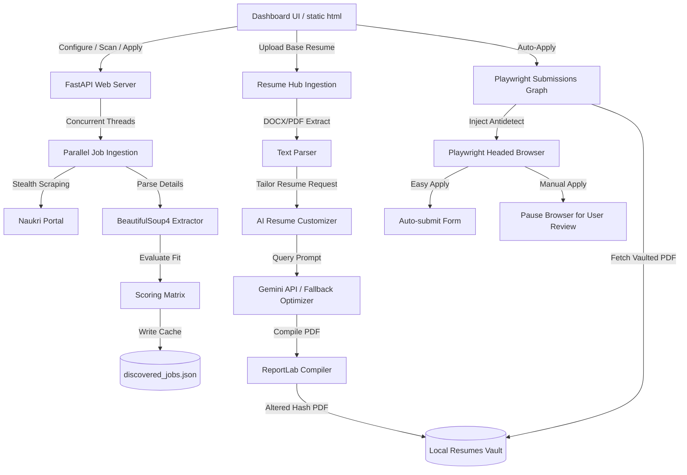

# 🚀 Autonomous Multi-Platform AI Job Application System

An autonomous, end-to-end job board search, ingestion, compatibility scoring, and form-filling engine. It features a premium, glassmorphic client control dashboard, an AI-powered Resume Hub with dual ATS optimization scorecards, and local document generation.

---

## 📖 Table of Contents
* 📘 **[Complete User Manual](file:///Users/nitinpradhan/Learning/job_application_system/doc/usermanual.md)**
* 🚀 **[Render Deployment Guide](file:///Users/nitinpradhan/Learning/job_application_system/doc/deployment.md)**
1. [Core Features](#-core-features)
2. [Subsystem Architecture & Components](#-subsystem-architecture--components)
3. [FastAPI REST API Reference](#-fastapi-rest-api-reference)
4. [Technology Stack](#-technology-stack)
5. [Prerequisites](#-prerequisites)
6. [Setup & Running Guide](#-setup--running-guide)
7. [Configuration Guide](#-configuration-guide)
8. [Verifying the Installation](#-verifying-the-installation)
9. [Usage Guide](#-usage-guide)

---

## ✨ Core Features

### 🔍 1. Multi-Threaded Ingestion & Scoring Engine
* **Concurrent Naukri Scans**: Crawls job boards concurrently across keyword/location pairs in a thread-safe worker pool, enforcing request rate caching to drop duplications.
* **Precision Search Filter Mapping**: Automatically maps technical skills from profiles to Naukri query vectors for highly targeted results.
* **Experience & Workplace Type Matching**: Prefilters results at the crawling source according to the candidate's seniority target ($\pm2$ years) and filters by workplace types (Remote, Hybrid, On-site) and application routes.
* **Weighted Linear Compatibility Score**: Scores roles using a multi-dimensional linear combination model ($Sc = \sum \omega_j \cdot \sigma_j$) analyzing title matches, skills matrices, location constraints, and company blacklists.

### 📄 2. AI-Powered Resume Hub & Vault
* **Ingestion Zone**: Drag-and-drop ingestion of PDF and DOCX formats. Features docx unzipping and XML text parsing natively without compiled third-party dependencies.
* **ATS Compatibility Auditing**: circular conic scorecard gauges displaying Original vs. Tailored scores side-by-side (Original in Red/Danger, Tailored in Teal/Accent).
* **Side-by-Side Visual Diffs**: Custom word-level highlights displaying layout-agnostic additions (in green) and deletions (in red strike-through) between original and tailored structures.
* **Local Resumes Vault**: Secures generated PDFs and JSON configurations locally inside `assets/{company_name}_resume/` directories to preserve data localism, supporting Secure Deletions.
* **Secure SMTP Emailer**: Decrypts passwords stored securely on disk to email tailored PDFs with attachments over TLS/SSL connections.

### 🤖 3. Custom Resume Customizer
* **Preservation Engine**: Structures raw resumes dynamically without enforcing rigid candidate templates, maintaining original margins, headings, section order, and layout.
* **Gemini Optimization Loop**: Custom tailors the resume text to match target keywords and responsibilities utilizing `gemini-3.5-flash` or `gemini-3.1-flash-lite` models to hit an 85%+ compatibility threshold.
* **Robust Local Fallback**: Automatically fallbacks to local keyword injection heuristics in $0.1$ seconds upon detecting a 429 quota exhaustion limit.
* **Cryptographic Hash Buster**: Programmatically alters hidden PDF metadata hashes, ensuring upload databases register each document as completely unique.

### 🛠️ 4. Stateful Playwright Submissions Driver
* **Playwright Fill Graph**: Represents form layouts as states, scanning page DOM elements, matching field accessibility labels, and filling text, selects, checkboxes, or uploading files.
* **Antidetect Automation**: Redefines browser attributes like `navigator.webdriver` to `undefined` before page load to hide automated crawler bot indicators.
* **Manual Intervention Mode**: For manual-apply configurations, crawler proceeds through form-filling and opens the headed browser context directly on the candidate's screen, bypassing the automated close block to allow manual review and click.

---

## 📐 Subsystem Architecture & Components

The application is structured as an event-driven system with a FastAPI web API server powering a local SPA dashboard, coupled with a stateful command-line interface for individual jobs.



### 1. Main Entry Point ([main.py](file:///Users/nitinpradhan/Learning/job_application_system/main.py))
Coordinates all CLI operations. Supports three principal parameters:
- `--action test-graph`: Simulates a mock DOM form-filling pipeline using the `FormGraphOrchestrator` to validate state transition correctness.
- `--action bump-naukri`: Logs in to Naukri, applies the PDF Hash Buster to the resume, and uploads it to refresh candidate timestamp visibility in search queries.
- `--action apply --job-id <id>`: Automates the entire sequence for a single job: extracts details, tailors the resume via AI, syncs it to Google Drive, and executes form submissions.

### 2. FastAPI Web Server ([src/server.py](file:///Users/nitinpradhan/Learning/job_application_system/src/server.py))
Serves static assets and provides JSON API endpoints. It runs background threads for crawling and applying, logs output to an on-screen terminal logger block, and handles configuration updates. Credentials (passwords, SMTP details, API keys) are written encrypted using Fernet cryptography.

### 3. Secure Browser Driver ([src/browser_driver.py](file:///Users/nitinpradhan/Learning/job_application_system/src/browser_driver.py))
Wraps Playwright's Chromium execution engine. Key capabilities:
- **Anti-Bot Evasions**: Injects custom Javascript on browser initialization that sets `navigator.webdriver = undefined`, overrides `navigator.plugins` to mimic a real desktop browser, and configures default languages.
- **CDP Integration**: Connects over a running Chrome debugger port (Chrome DevTools Protocol) to run automation inside an active native browser session.
- **Session Preservation**: Stores and restores cookies, localStorage, and browser configurations to `data/session_state.json` to keep Naukri login sessions persistent.

### 4. Job Ingestion & Extractor ([src/job_crawler.py](file:///Users/nitinpradhan/Learning/job_application_system/src/job_crawler.py))
Orchestrates parallel search-crawling. It generates query slugs matching candidate skills, crawls search results, extracts job details via BeautifulSoup4, and classifies apply types dynamically by checking for external redirect strings on active elements. It drops duplicate URLs and uses a fallback registry of high-fidelity local software engineering jobs when offline.

### 5. Scoring Matrix ([src/scoring.py](file:///Users/nitinpradhan/Learning/job_application_system/src/scoring.py))
Uses a weighted linear combination scoring model to determine match fitness. If a job title contains a blacklisted phrase, it is instantly disqualified ($0.0$).
* **Title Match (25% Weight)**: Matches title keywords.
* **Location Match (20% Weight)**: Verifies city target matches.
* **Tech Stack Match (25% Weight)**: Ratio of matched technologies.
* **Workplace Type Match (15% Weight)**: Matches Remote, Hybrid, or On-site preference.
* **Seniority Match (15% Weight)**: Compares years of experience required vs. candidate profile.

### 6. AI Resume Customizer ([src/resume_tweaker.py](file:///Users/nitinpradhan/Learning/job_application_system/src/resume_tweaker.py))
Optimizes resume configurations:
- **Gemini Context Loop**: Customizes the resume description, summary, skills matrix, and professional bullet points based on the target job description while retaining dates, places, and authentic titles.
- **0.1s Heuristic Fallback**: Instantly falls back to local regex matching and keyword insertion heuristics if the Gemini API key is missing or rate limits are hit.
- **ReportLab Compiler**: Renders structured JSON data into structured, single-column, highly readable, ATS-compliant PDFs with custom margin controls.

### 7. Cryptographic Hash Buster ([src/document_generator.py](file:///Users/nitinpradhan/Learning/job_application_system/src/document_generator.py))
Appends randomized metadata attributes (`/ModifierID`, `/Keywords`) to compiled PDFs. This alters the file's binary signature and cryptographic hash (MD5, SHA-256) on every generation, preventing Naukri from identifying the upload as a duplicate document, thereby triggering profile update ranking loops.

### 8. Stateful Form Graph ([src/form_graph.py](file:///Users/nitinpradhan/Learning/job_application_system/src/form_graph.py))
Models online application forms as stateful machines. It iterates through four state nodes:
1. **Initialize**: Validates the endpoint security protocol and URL.
2. **Extract**: Scrapes input fields, selects, textareas, file upload targets, and associates adjacent descriptive labels.
3. **Generate**: Binds user data (names, demographics, compliance answers) to inputs.
4. **Assemble**: Generates the form payload, uploads PDFs, takes browser screenshots, and clicks submit.

### 9. Google Drive Synchronization ([src/gdrive_manager.py](file:///Users/nitinpradhan/Learning/job_application_system/src/gdrive_manager.py))
If synchronization is enabled, automatically uploads generated PDFs to the user's Google Drive. Once verified, it securely deletes local copies to prevent local document leakage, downloading them back on-the-fly only when needed for browser submission.

### 10. Cryptographic Key Vault ([src/crypto_manager.py](file:///Users/nitinpradhan/Learning/job_application_system/src/crypto_manager.py))
Implements Fernet symmetric encryption to encrypt secrets on disk (`config/constants.py`). Decryption keys are loaded securely at runtime, ensuring sensitive credentials (Naukri password, API keys, SMTP credentials) are never stored in plaintext format.

---

## FastAPI REST API Reference

The backend web server exposes the following endpoints for the frontend dashboard:

| Endpoint | Method | Description |
| :--- | :--- | :--- |
| `/api/config` | `GET` | Retrieves `searches.yaml` content and decrypted constants from `constants.py`. |
| `/api/config` | `POST` | Safely encrypts and updates configurations on disk. |
| `/api/run` | `POST` | Launches main.py actions (`test-graph` / `bump-naukri`) in background threads. |
| `/api/logs` | `GET` | Returns running log streams from background tasks. |
| `/api/jobs` | `GET` | Fetches discovered and compatibility-scored listings. |
| `/api/jobs/scan` | `POST` | Triggers a multi-threaded parallel crawl of Naukri job boards. |
| `/api/jobs/scan/status` | `GET` | Returns scanning state (`is_scanning` and count). |
| `/api/jobs/{job_id}/tailor` | `POST` | Tailors the resume PDF/JSON, computes ATS audits, and uploads to GDrive. |
| `/api/jobs/{job_id}/tailor/view`| `GET` | Streams the tailored PDF inline for on-dashboard PDF rendering. |
| `/api/jobs/{job_id}/tailor/download`| `GET`| Downloads the compiled tailored PDF. |
| `/api/jobs/{job_id}/tailored_data` | `GET` | Gets or computes the raw tailored JSON structure on the fly. |
| `/api/jobs/{job_id}/apply` | `POST` | Commences the automated apply script sequence for the selected job. |
| `/api/resume/original` | `GET` | Gets the default base candidate resume structure template. |
| `/api/resume/upload` | `POST` | Ingests PDF/DOCX resumes, structures text via Gemini, and parses components. |
| `/api/resume/email` | `POST` | Sends the tailored PDF as a secure SMTP attachment. |

---

## 💻 Technology Stack

### Backend Core
* **Language**: Python 3.11+
* **Framework**: FastAPI (REST endpoints, static file mounting, background tasks)
* **Web Scraping**: Playwright, BeautifulSoup4
* **PDF Compile & Parse**: ReportLab Flowables, PyPDF
* **AI/LLM Integration**: Google GenAI SDK (Gemini API client)
* **Storage**: JSON Flat File DB (`data/discovered_jobs.json`), Local Assets File vault
* **Security**: Cryptography (Fernet-encrypted SMTP settings)

### Frontend Dashboard
* **Structure & UI**: HTML5, Semantic DOM structure
* **Styling**: Vanilla CSS (CSS Custom Properties, Glassmorphism backdrop-filters, flex grids, fade transitions)
* **Logic**: Vanilla ES6+ JavaScript (State management, local storage sync, progress polling callbacks)
* **Autocomplete Integrations**: 
  * *StackExchange API* (skills suggestion)
  * *Clearbit Autocomplete API* (company names)
  * *Wikidata Entity Search API* (blacklist titles)

---

## 📋 Prerequisites
* **Python**: `python >= 3.11` (Python 3.12 recommended)
* **Package Manager**: `pip` or `uv`
* **Web Engine**: Playwright Chromium binary

---

## ⚙️ Setup & Running Guide

Here are the complete commands to get the application installed, configured, and running locally.

### Option A: Using `uv` (Recommended & Faster)

If you have `uv` installed, run these commands from the root directory:

```bash
# 1. Install dependencies and create a virtual environment
uv sync --all-groups

# 2. Install Playwright browser binaries
.venv/bin/playwright install chromium

# 3. Start the application server
.venv/bin/python -m uvicorn src.server:app --host 0.0.0.0 --port 8000 --reload
```

---

### Option B: Using standard `venv` and `pip`

If you are using standard Python tools, run these commands from the root directory:

```bash
# 1. Create a virtual environment
python -m venv .venv

# 2. Activate the virtual environment
source .venv/bin/activate

# 3. Install the application and dependencies in editable mode
pip install -e .

# 4. Install Playwright browser binaries
playwright install chromium

# 5. Start the application server
uvicorn src.server:app --host 0.0.0.0 --port 8000 --reload
```

Once started, open your browser and navigate to: **`http://localhost:8000`**

---

## 🔧 Configuration Guide

### 1. Searches & Filters (`config/searches.yaml`)
Configure your target searches, candidate profile parameters, locations, and blacklists directly inside the config file. Example:
```yaml
candidate_details:
  name: "John Doe"
  email: "john.doe@example.com"
  phone: "+91-9876543210"
  experience_years: 7.0
  target_role: "Senior Software Engineer"
  technical_skills:
    - "Python"
    - "FastAPI"
    - "React"
    - "AWS"

search_filters:
  positions:
    - "Software Engineer"
    - "Full Stack Developer"
  locations:
    - "Pune"
    - "Remote"
  blacklist_companies:
    - "BadCompany Corp"
  blacklist_titles:
    - "Manager"
```

### 2. Secret Credentials & Key Management
Keys are handled securely on the dashboard. Run the server, click the **Secrets & Keys** tab, and specify:
* **Gemini API Key**: Used for custom resume tailoring and detailed job description summarization.
* **SMTP Settings**: Host, port, user credentials (decrypted at runtime to send PDF emails directly).

---

## 🧪 Verifying the Installation

Execute the test suite to verify that all modules are running perfectly:

```bash
# Run unit and integration tests
./.venv/bin/python -m unittest discover tests
```

---

## 💡 Usage Guide

1. **Drag-and-Drop Ingestion**:
   * Go to **📄 Resume Hub** tab.
   * Drag your original `.pdf` or `.docx` resume into the drop zone. The system will extract the text, run structuring fallbacks, and populate the scorecard interface.
2. **General Resume Critique (General Audit)**:
   * Click **📊 Analyze ATS (Old)** on the scorecard without entering a job URL. The system runs an automated critique on layouts, formatting, and overall readability.
3. **Target Match Auditing**:
   * Paste a valid job URL from LinkedIn, Naukri, or Indeed, and click **Analyze**. The system crawls the details, runs ATS keyword checks against the job description, and outputs matching indicators.
4. **Tailoring**:
   * Click **Tailor & Match**. The system automatically customizes the resume JSON (using Gemini or local heuristics), compiles a cryptographic unique PDF, caches the layout, and displays side-by-side Circle Gauges and Visual Diffs.
5. **Auto-Apply Submissions**:
   * Switch to **Discovered Listings** tab.
   * Click **🚀 Auto Apply** for Easy Apply jobs to automatically submit forms, or **🛠️ Manual Apply** for external pages to fill details and pause on screen for manual review.
