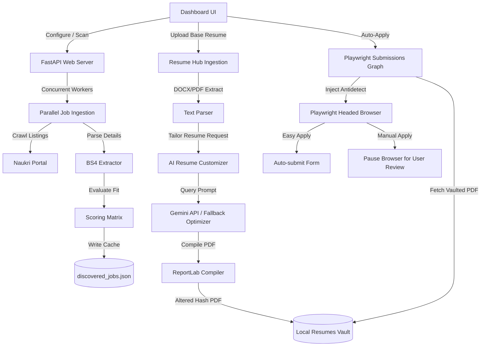

# 🚀 Autonomous Multi-Platform AI Job Application System

An autonomous, end-to-end job board search, ingestion, compatibility scoring, and form-filling engine. It features a premium, glassmorphic client control dashboard, an AI-powered Resume Hub with dual ATS optimization scorecards, and local document generation.

---

## 📖 Table of Contents
1. [Core Features](#-core-features)
2. [Architecture Overview](#-architecture-overview)
3. [Technology Stack](#-technology-stack)
4. [Prerequisites](#-prerequisites)
5. [Installation & Setup](#-installation--setup)
6. [Configuration Guide](#-configuration-guide)
7. [Running the Application](#-running-the-application)
8. [Verifying the Installation](#-verifying-the-installation)
9. [Usage Guide](#-usage-guide)

---

## ✨ Core Features

### 🔍 1. Multi-Threaded Ingestion & Scoring Engine
* **Concurrent Naukri Scans**: Crawls job boards concurrently across keyword/location pairs in a thread-safe worker pool, enforcing request rate caching to drop duplications.
* **Precision Search Filter Mapping**: Automatically maps technical skills from profiles to Naukri query vectors for highly targeted results.
* **Experience & Workplace Type Matching**: Prefilters results at the crawling source according to the candidate's seniority target ($\pm2$ years) and filters by workplace types (Remote, Hybrid, On-site) and application routes.
* **Weighted Linear Compatibility Score**: Scores roles using a multi-dimensional linear combination model ($Sc = \sum \omega_j \cdot \sigma_j$) analyzing title matches, skills matrices, location constraints, and company blacklists.

### 📄 2. AI-Powered Resume Hub & Vault
* **Ingestion Zone**: Drag-and-drop ingestion of PDF and DOCX formats. Features docx unzipping and text parsing without compiled third-party dependencies.
* **ATS Compatibility Auditing**: circular conic scorecard gauges displaying Original vs. Tailored scores side-by-side (Original in Red/Danger, Tailored in Teal/Accent).
* **Side-by-Side Visual Diffs**: Custom word-level highlights displaying layout-agnostic additions (in green) and deletions (in red strike-through) between original and tailored structures.
* **Local Resumes Vault**: Secures generated PDFs and JSON configurations locally inside `assets/{company_name}_resume/` directories to preserve data localism, supporting Secure Deletions.
* **Secure SMTP Emailer**: Decrypts passwords stored securely on disk to email tailored PDFs with attachments over TLS/SSL TLS/SSL connections.

### 🤖 3. Custom Resume Customizer
* **Preservation Engine**: Structures raw resumes dynamically without enforcing rigid candidate templates, maintaining original margins, headings, section order, and layout.
* **Gemini Optimization Loop**: Custom tailors the resume text to match target keywords and responsibilities utilizing `gemini-3.5-flash` or `gemini-3.1-flash-lite` models to hit an 85%+ compatibility threshold.
* **Robust Local Fallback**: Automatically fallbacks to local keyword injection heuristics in $0.1$ seconds upon detecting a 429 quota exhaustion limit.
* **Cryptographic Hash Buster**: Programmatically alters hidden PDF metadata hashes, ensuring upload databases register each document as completely unique.

### 🛠️ 4. Stateful Playwright Submissions Driver
* **Playwright Fill Graph**: Represents form layouts as states, scanning page DOM elements, matching field accessibility labels, and filling text, selects, checkboxes, or uploading files.
* **Antidetect Automation**: Redefines browser attributes like `navigator.webdriver` to `undefined` before page load to hide automated crawler bot indicators.
* **Manual Intervention Mode**: For manual-apply configurations, crawler proceeds through form-filling and opens the headed browser context directly on the candidate's screen, bypassing the automated close block to allow manual review and click.

---

## 📐 Architecture Overview



---

## 💻 Technology Stack

### Backend Core
* **Language**: Python 3.11+
* **Framework**: FastAPI (REST endpoints, static file mounting, background tasks)
* **Web Scraping**: Playwright, BeautifulSoup4
* **PDF Compile & Parse**: ReportLab Flowables, PyPDF
* **AI/LLM Integration**: Google GenAI SDK (Gemini API client)
* **Storage**: JSON Flat File DB (`data/discovered_jobs.json`), Local Assets File vault
* **Security**: Cryptography (Fernet-encrypted SMTP settings)

### Frontend Dashboard
* **Structure & UI**: HTML5, Semantic DOM structure
* **Styling**: Vanilla CSS (CSS Custom Properties, Glassmorphism backdrop-filters, flex grids, fade transitions)
* **Logic**: Vanilla ES6+ JavaScript (State management, local storage sync, progress polling callbacks)
* **Autocomplete Integrations**: 
  * *StackExchange API* (skills suggestion)
  * *Clearbit Autocomplete API* (company names)
  * *Wikidata Entity Search API* (blacklist titles)

---

## 📋 Prerequisites
* **Python**: `python >= 3.11` (Python 3.12 recommended)
* **Package Manager**: `pip` or `uv`
* **Web Engine**: Playwright Chromium binary

---

## ⚙️ Setup & Running Guide

Here are the complete commands to get the application installed, configured, and running locally.

### Option A: Using `uv` (Recommended & Faster)

If you have `uv` installed, run these commands from the root directory:

```bash
# 1. Install dependencies and create a virtual environment
uv sync --all-groups

# 2. Install Playwright browser binaries
.venv/bin/playwright install chromium

# 3. Start the application server
.venv/bin/python -m uvicorn src.server:app --host 0.0.0.0 --port 8000 --reload
```

---

### Option B: Using standard `venv` and `pip`

If you are using standard Python tools, run these commands from the root directory:

```bash
# 1. Create a virtual environment
python -m venv .venv

# 2. Activate the virtual environment
source .venv/bin/activate

# 3. Install the application and dependencies in editable mode
pip install -e .

# 4. Install Playwright browser binaries
playwright install chromium

# 5. Start the application server
uvicorn src.server:app --host 0.0.0.0 --port 8000 --reload
```

Once started, open your browser and navigate to: **`http://localhost:8000`**

---

## 🔧 Configuration Guide

### 1. Searches & Filters (`config/searches.yaml`)
Configure your target searches, candidate profile parameters, locations, and blacklists directly inside the config file. Example:
```yaml
candidate_details:
  name: "John Doe"
  email: "john.doe@example.com"
  phone: "+91-9876543210"
  experience_years: 7.0
  target_role: "Senior Software Engineer"
  technical_skills:
    - "Python"
    - "FastAPI"
    - "React"
    - "AWS"

search_filters:
  positions:
    - "Software Engineer"
    - "Full Stack Developer"
  locations:
    - "Pune"
    - "Remote"
  blacklist_companies:
    - "BadCompany Corp"
  blacklist_titles:
    - "Manager"
```

### 2. Secret Credentials & Key Management
Keys are handled securely on the dashboard. Run the server, click the **Secrets & Keys** tab, and specify:
* **Gemini API Key**: Used for custom resume tailoring and detailed job description summarization.
* **SMTP Settings**: Host, port, user credentials (decrypted at runtime to send PDF emails directly).

---

## 🧪 Verifying the Installation

Execute the test suite to verify that all modules are running perfectly:

```bash
# Run unit and integration tests
./.venv/bin/python -m unittest discover tests
```

---

## 💡 Usage Guide

1. **Drag-and-Drop Ingestion**:
   * Go to **📄 Resume Hub** tab.
   * Drag your original `.pdf` or `.docx` resume into the drop zone. The system will extract the text, run structuring fallbacks, and populate the scorecard interface.
2. **General Resume Critique (General Audit)**:
   * Click **📊 Analyze ATS (Old)** on the scorecard without entering a job URL. The system runs an automated critique on layouts, formatting, and overall readability.
3. **Target Match Auditing**:
   * Paste a valid job URL from LinkedIn, Naukri, or Indeed, and click **Analyze**. The system crawls the details, runs ATS keyword checks against the job description, and outputs matching indicators.
4. **Tailoring**:
   * Click **Tailor & Match**. The system automatically customizes the resume JSON (using Gemini or local heuristics), compiles a cryptographic unique PDF, caches the layout, and displays side-by-side Circle Gauges and Visual Diffs.
5. **Auto-Apply Submissions**:
   * Switch to **Discovered Listings** tab.
   * Clicks **🚀 Auto Apply** for Easy Apply jobs to automatically submit forms, or **🛠️ Manual Apply** for external pages to fill details and pause on screen for manual review.

---
*Created and maintained by Nitin Pradhan.*
