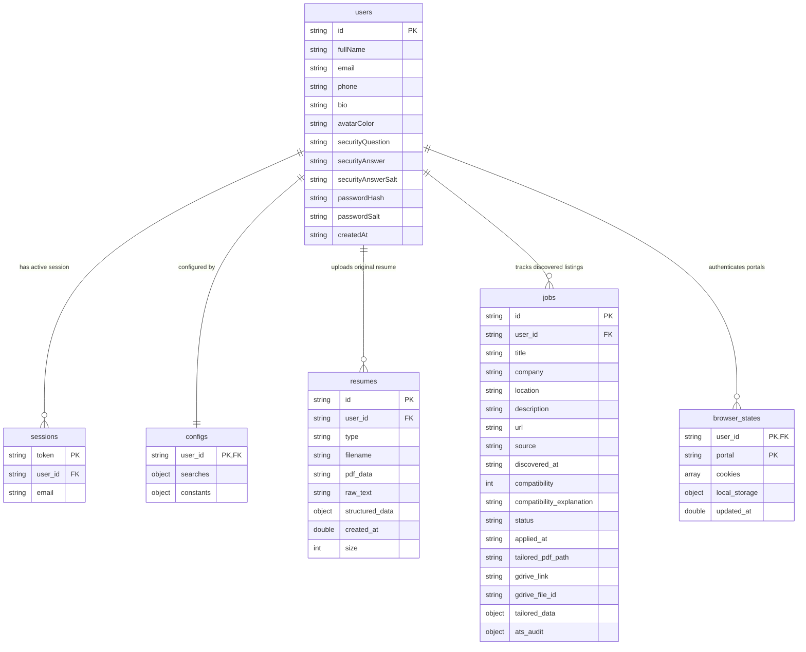

# Database Schema & Architecture

This document describes the database design, tables (collections), and dynamic schema configurations of the Aegis Flow Job Application System. The application utilizes a stateless, multi-user MongoDB architecture to ensure strict user isolation, seamless cloud deployment (e.g. on Render), and direct database persistence of all assets and configuration details.

---

## 🗺️ Entity Relationship (ER) Diagram
The following diagram illustrates how collections are connected in MongoDB. Every user's record set is isolated via references to the primary `users` collection:



---

## 🏛️ Database Overview
MongoDB is the single source of truth for the application. No persistent files are written to local disk in production. All user sessions, target scopes, compliance preferences, API secrets, discovered job cards, browser authentication states, and uploaded resumes are stored in collections.

---

## 🗂️ Collections & Schema Definitions

The database `aegis_flow` contains the following collections:
1. [users](#1-users)
2. [sessions](#2-sessions)
3. [configs](#3-configs)
4. [resumes](#4-resumes)
5. [jobs](#5-jobs)
6. [browser_states](#6-browser_states)

---

### 1. `users`
Stores candidate account profiles, credentials, and verification keys.

| Field Name | Type | Description |
| :--- | :--- | :--- |
| `id` | `String` (UUID) | Unique user identifier. |
| `fullName` | `String` | Candidate's full name. |
| `email` | `String` | Candidate's email address (normalized/lowercase). |
| `phone` | `String` | Candidate's telephone number. |
| `bio` | `String` | Optional bio or brief summary. |
| `avatarColor`| `String` | UI avatar theme color. |
| `securityQuestion` | `String` | Password recovery security question. |
| `securityAnswer` | `String` | Decryptable answer hash. |
| `securityAnswerSalt` | `String` | Unique salt value for security answer. |
| `passwordHash` | `String` | Secure password hash. |
| `passwordSalt` | `String` | Password salt string. |
| `createdAt` | `String` (ISO Date) | Account creation timestamp. |

#### Sample Document:
```json
{
  "_id": "60c72b2f9b1d8b2c4c8b4567",
  "id": "c7a8b12f-dbca-4993-9b2d-ec82a93c71a3",
  "fullName": "Nitin Pradhan",
  "email": "nitinpradhan48@gmail.com",
  "phone": "+919876543210",
  "bio": "Full Stack Software Engineer specializing in C#, React, and Python.",
  "avatarColor": "from-indigo-500 to-purple-600",
  "securityQuestion": "What was the name of your first pet?",
  "securityAnswer": "OBF::bXktcGV0LW5hbWU=",
  "securityAnswerSalt": "salt_987654321",
  "passwordHash": "a9f8e7d6c5b4a3...",
  "passwordSalt": "salt_123456789",
  "createdAt": "2026-05-30T17:15:30.123456"
}
```

---

### 2. `sessions`
Tracks active user login sessions and maps short-lived tokens to user IDs.

| Field Name | Type | Description |
| :--- | :--- | :--- |
| `token` | `String` (UUID) | Active Bearer authentication token. |
| `user_id` | `String` (UUID) | Reference to `users.id`. |
| `email` | `String` | Normalized email address. |

#### Sample Document:
```json
{
  "_id": "60c72b2f9b1d8b2c4c8b4568",
  "token": "7d9a1b2c-efab-4112-8c1d-dc91a23c72b4",
  "user_id": "c7a8b12f-dbca-4993-9b2d-ec82a93c71a3",
  "email": "nitinpradhan48@gmail.com"
}
```

---

### 3. `configs`
Stores all configurations entered on the **Search Scope**, **EEO & Declarations**, and **Secrets & Keys** tabs.

| Field Name | Type | Description |
| :--- | :--- | :--- |
| `user_id` | `String` (UUID) | Reference to `users.id` (Primary Key). |
| `searches` | `Object` | Contains search scope and compliance declarations. |
| `constants` | `Object` | Contains API keys, sync variables, and credential paths. |

#### `searches` Sub-document Structure:
* `search_parameters`:
  * `positions`: Array of target job titles.
  * `locations`: Array of locations to scan.
  * `distance`: Maximum travel radius limit (miles).
  * `candidate_experience_years`: Experience filter (float).
  * `candidate_skills`: Array of technical candidate skills.
  * `remote`: Remote-only filter (boolean).
  * `apply_once_at_company`: Avoid duplicate applications (boolean).
  * `target_portals`: Map of portal IDs to boolean values (e.g. `{"linkedin": true, "naukri": true}`).
  * `companyBlacklist`: Array of companies to exclude.
  * `titleBlacklist`: Array of title keywords to exclude.
* `compliance_preferences`: EEO declarations (e.g., `remote_work`, `open_to_relocation`, `willing_to_complete_assessments`, etc.).
* `candidate_identity.demographics`: EEO demographic selections (e.g., `gender`, `pronouns`, `ethnicity`, `veteran_status`).

#### `constants` Sub-document Structure:
* `RESUME_PATH`: Location identifier pointing to `database:resumes.<id>`.
* `GEMINI_API_KEY`: Obfuscated Gemini API key string.
* `SOLVER_API_KEY`: Obfuscated Captcha bypass key string.
* `AGENT_BROWSER_HEADED`: Run browser in visible headed mode (boolean).
* `AGENT_BROWSER_CDP`: Local debugger socket address (string).
* `GDRIVE_SYNC_ENABLED`: Enable background Google Drive synchronization (boolean).
* `GDRIVE_CLIENT_SECRETS_CONTENT`: Google Client OAuth secrets JSON configuration dictionary.
* `GDRIVE_TOKEN_CONTENT`: Google user authorization OAuth token dictionary.
* Portal passwords (e.g., `LINKEDIN_PASSWORD`, `NAUKRI_PASSWORD`, etc.) stored in `OBF::` obfuscated format.

#### Sample Config Document:
```json
{
  "_id": "60c72b2f9b1d8b2c4c8b4569",
  "user_id": "c7a8b12f-dbca-4993-9b2d-ec82a93c71a3",
  "searches": {
    "search_parameters": {
      "positions": ["Software Engineer", "Full Stack Developer"],
      "locations": ["Remote", "Pune"],
      "distance": null,
      "candidate_experience_years": 7.0,
      "candidate_skills": ["C#", "React", "Python"],
      "remote": true,
      "apply_once_at_company": true,
      "target_portals": {
        "linkedin": true,
        "naukri": true
      },
      "companyBlacklist": ["Unwanted Agency"],
      "titleBlacklist": ["Sales"]
    },
    "compliance_preferences": {
      "remote_work": "Yes",
      "in_person_work": "No",
      "open_to_relocation": "No",
      "relocation_destinations": "",
      "willing_to_complete_assessments": "Yes",
      "willing_to_undergo_drug_tests": "No",
      "willing_to_undergo_background_checks": "Yes"
    },
    "candidate_identity": {
      "demographics": {
        "gender": "Male",
        "pronouns": "He/Him",
        "ethnicity": "Asian",
        "veteran_status": "No"
      }
    }
  },
  "constants": {
    "RESUME_PATH": "database:resumes.e5c9b740-4284-4fa0-82cb-b1d5a7d65ee1",
    "GEMINI_API_KEY": "OBF::QUl6YVN5RGpfZXhhbXBsZV9rZXk=",
    "SOLVER_API_KEY": "",
    "AGENT_BROWSER_HEADED": true,
    "AGENT_BROWSER_CDP": "",
    "GDRIVE_SYNC_ENABLED": true,
    "GDRIVE_CLIENT_SECRETS_CONTENT": {
      "web": {
        "client_id": "12345.apps.googleusercontent.com",
        "project_id": "aegis-flow",
        "auth_uri": "https://accounts.google.com/o/oauth2/auth",
        "token_uri": "https://oauth2.googleapis.com/token"
      }
    },
    "GDRIVE_TOKEN_CONTENT": {
      "token": "ya29.a0AfH6SM...",
      "refresh_token": "1//04...",
      "token_uri": "https://oauth2.googleapis.com/token",
      "client_id": "12345.apps.googleusercontent.com",
      "scopes": ["https://www.googleapis.com/auth/drive.file"]
    }
  }
}
```

---

### 4. `resumes`
Stores candidate original uploaded resumes. This keeps the application stateless, bypassing local container filesystem uploads.

| Field Name | Type | Description |
| :--- | :--- | :--- |
| `id` | `String` (UUID) | Unique resume document identifier. |
| `user_id` | `String` (UUID) | Reference to `users.id`. |
| `type` | `String` | Type of resume (e.g. `"original"`). |
| `filename` | `String` | The original file name (e.g., `MyResume.pdf`). |
| `pdf_data` | `String` (Base64) | Entire binary PDF file contents encoded as base64. |
| `raw_text` | `String` | Raw text extracted from the PDF pages. |
| `structured_data` | `Object` | Extracted JSON metadata structure (skills, positions, years). |
| `created_at` | `Double` (Epoch) | File upload timestamp. |
| `size` | `Int` | File size in bytes. |

#### Sample Document:
```json
{
  "_id": "60c72b2f9b1d8b2c4c8b4570",
  "id": "e5c9b740-4284-4fa0-82cb-b1d5a7d65ee1",
  "user_id": "c7a8b12f-dbca-4993-9b2d-ec82a93c71a3",
  "type": "original",
  "filename": "Nitin_Pradhan_Resume.pdf",
  "pdf_data": "JVBERi0xLjQKJdPr6gokQ29udGVudHMgYmFzZTY0...",
  "raw_text": "Nitin Pradhan\nEmail: nitinpradhan48@gmail.com\nExperience...",
  "structured_data": {
    "candidate_experience_years": 7.0,
    "candidate_skills": ["C#", "React", "TypeScript", "AWS"],
    "positions": ["Software Engineer", "Full Stack Developer"]
  },
  "created_at": 1780168340.5,
  "size": 142530
}
```

---

### 5. `jobs`
Maintains discovered jobs history, compatibility scores, tailoring inputs, and state details.

| Field Name | Type | Description |
| :--- | :--- | :--- |
| `id` | `String` (UUID) | Unique job item identifier. |
| `user_id` | `String` (UUID) | Reference to `users.id`. |
| `title` | `String` | Job posting title. |
| `company` | `String` | Hiring company name. |
| `location` | `String` | Workplace location. |
| `description` | `String` | Raw job description details. |
| `url` | `String` | Direct portal posting URL link. |
| `source` | `String` | Discovery portal source (e.g. `naukri`, `linkedin`). |
| `discovered_at` | `String` (ISO) | Date/time job listing was pulled. |
| `compatibility` | `Int` | Computed AI compatibility score (0-100%). |
| `compatibility_explanation` | `String` | Score breakdown commentary text. |
| `status` | `String` | Funnel state (e.g., `Discovered`, `Tailored`, `Applied`, `Ignored`). |
| `applied_at` | `String` | Timestamp of auto-apply execution (null if unapplied). |
| `tailored_pdf_path` | `String` | Reference path (local temporary file or Drive link). |
| `gdrive_link` | `String` | URL to tailored resume synced on Google Drive. |
| `gdrive_file_id` | `String` | Google Drive File ID of the synced tailored resume. |
| `tailored_data` | `Object` | Customized tailored resume JSON document. |
| `ats_audit` | `Object` | ATS compliance breakdown results (score, keywords, suggestions). |

#### Sample Document:
```json
{
  "_id": "60c72b2f9b1d8b2c4c8b4571",
  "id": "j9a2b3c4-e8d9-4112-9c1b-ec91a38c82ab",
  "user_id": "c7a8b12f-dbca-4993-9b2d-ec82a93c71a3",
  "title": "Senior Full Stack Engineer",
  "company": "Enterprise Software Corp",
  "location": "Pune, India",
  "description": "We are seeking a senior engineer experienced in C#, React, and cloud platforms...",
  "url": "https://www.naukri.com/job-listings...",
  "source": "naukri",
  "discovered_at": "2026-05-30T17:20:00",
  "compatibility": 95,
  "compatibility_explanation": "Strong alignment with core technologies (C#, React) and years of experience.",
  "status": "Applied",
  "applied_at": "2026-05-30T17:28:15",
  "tailored_pdf_path": "data/Modified_Resume.pdf",
  "gdrive_link": "https://docs.google.com/file/d/1a2b3c...",
  "gdrive_file_id": "1a2b3c...",
  "tailored_data": {
    "name": "Nitin Pradhan",
    "skills": ["C#", ".NET Core", "React", "TypeScript"],
    "experience": []
  },
  "ats_audit": {
    "score": 92,
    "matched_keywords": ["C#", "React", "Enterprise"],
    "missing_keywords": ["Microservices"],
    "recommendations": ["Add details about microservice deployments."]
  }
}
```

---

### 6. `browser_states`
Saves authentication cookies and localStorage data structures for individual job portals. This allows stateless automated browsers to resume logged-in sessions without re-authenticating.

| Field Name | Type | Description |
| :--- | :--- | :--- |
| `user_id` | `String` (UUID) | Reference to `users.id`. |
| `portal` | `String` | Portal identifier (e.g. `"naukri"`, `"linkedin"`). |
| `cookies` | `Array` | List of JSON-serialized cookie objects. |
| `local_storage` | `Object` | Map of localStorage key/value entries. |
| `updated_at` | `Double` (Epoch) | Last update timestamp. |

#### Sample Document:
```json
{
  "_id": "60c72b2f9b1d8b2c4c8b4572",
  "user_id": "c7a8b12f-dbca-4993-9b2d-ec82a93c71a3",
  "portal": "naukri",
  "cookies": [
    {
      "name": "session_id",
      "value": "xyz123abc456",
      "domain": ".naukri.com",
      "path": "/",
      "expires": 1780254340.0,
      "httpOnly": true,
      "secure": true
    }
  ],
  "local_storage": {
    "user_preferences": "{\"theme\":\"dark\"}"
  },
  "updated_at": 1780168340.0
}
```

---

## 🔒 Security & Encryption Rules
All sensitive columns listed in `config.constants.SENSITIVE_KEYS` (e.g., `PASSWORD`, API keys, SMTP secrets) are encrypted to prevent cleartext visibility:
1. **Frontend Obfuscation**: The frontend wraps entries inside a base64 encoded token prefixed with `OBF::` before sending to the backend, securing client-side states.
2. **Server symmetric encryption**: Before saving to disk fallbacks or processing configurations, the backend supports encrypting fields via AES symmetric encryption prefixed with `ENC::`.
3. **On-the-fly Decryption**: Database queries and background automations read configuration keys dynamically using custom getters (`constants.py:__getattr__`), automatically translating `OBF::` and `ENC::` prefixes into cleartext values in-memory.
