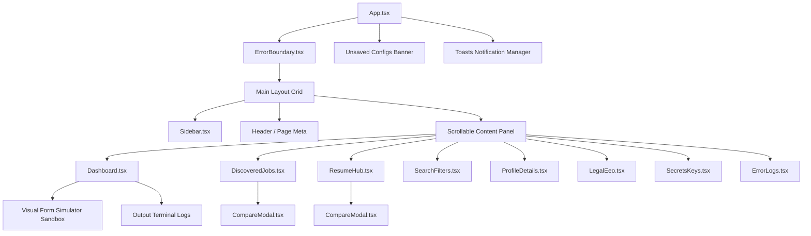

# 💻 Aegis Flow - React Client Dashboard

This directory contains the migrated React client dashboard for the Autonomous AI Job Application System. Built on top of React 19, Vite, and Tailwind CSS v4, it provides a highly responsive, modern glassmorphic interface to control job searches, customize resumes, review ATS audits, and monitor background crawlers.

---

## 🛠️ Technology Stack

* **Core Framework**: React 19 (Component-based architecture, hooks, and error boundaries)
* **Build Engine**: Vite 8+ (Fast HMR & asset compilation)
* **Styling System**: Tailwind CSS v4.0 (Glassmorphic cards, custom gradients, and CSS custom variables)
* **Language**: TypeScript 6+ (Type-safe component interfaces)
* **Automation Testing**: Playwright (E2E flows validation)
* **Icons**: Lucide React

---

## 📐 Component Architecture Hierarchy

The frontend dashboard is designed as a single-page application structured cleanly around reusable UI elements:



---

## 📁 Directory Structure & Components

```
frontend/
├── e2e/
│   └── app.spec.ts             # Playwright E2E integration test suite
├── src/
│   ├── App.tsx                 # Core App layout, state router, global listeners, and save banner
│   ├── main.tsx                # Client entrypoint mounting react dom tree
│   ├── vite-env.d.ts           # Vite client environment declarations
│   ├── index.css               # Global CSS entrypoint initializing Tailwind CSS
│   ├── components/
│   │   ├── Sidebar.tsx         # Responsive glassmorphic navigation sidebar
│   │   ├── Dashboard.tsx       # System action triggers, Visual Form Simulator, and log console
│   │   ├── DiscoveredJobs.tsx  # Interactive jobs board, keyword filters, and accordion descriptions
│   │   ├── ResumeHub.tsx       # Resume uploads, crawling crawler sync, and email client forms
│   │   ├── ErrorLogs.tsx       # Developer panel for backend tracebacks and JS script exceptions
│   │   ├── CompareModal.tsx    # Side-by-side original vs tailored resume diff highlights modal
│   │   └── ErrorBoundary.tsx   # Uncaught render error catcher and automated backend logger
│   └── utils/
│       └── helpers.ts          # UI state, string manipulations, and formatting helpers
├── playwright.config.ts        # Playwright framework configurations
├── tailwind.config.js          # Tailwind custom theme styles (if required)
├── tsconfig.json               # TypeScript compiler config
└── package.json                # npm package dependency configurations
```

---

## 🚀 Verification & Development Tasks

Here are the commands to compile, check, and test the React frontend:

### 1. Run Development Server
Launches the hot-reloading Vite dev server:
```bash
npm run dev
```

### 2. Verify TypeScript Compilation & Linting
Run static type check and lint validation:
```bash
# Typecheck
npx tsc --noEmit

# Lint
npm run lint
```

### 3. Compile Production Bundle
Builds optimized production static assets into `../static` (to be served by FastAPI):
```bash
npm run build
```

### 4. Run Playwright E2E Integration Tests
Ensure the FastAPI server is running on port `8000` (`http://localhost:8000`), then run:
```bash
npx playwright test
```
This runs the integration suite against Chrome, asserting dashboard components, jobs listings, configuration changes, and error log routing.
